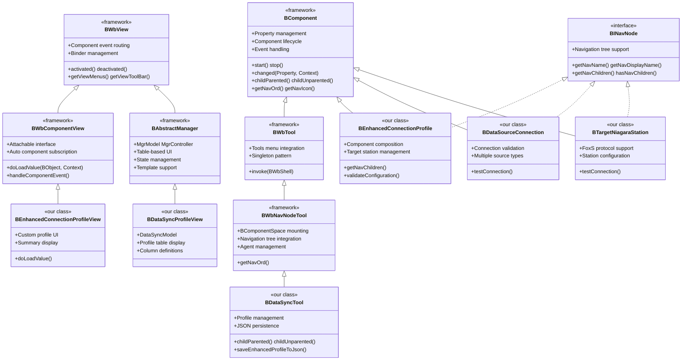

# N4-DataSync Inheritance Hierarchy and Framework Features

## Overview

This document provides a comprehensive analysis of the inheritance hierarchy used in the N4-DataSync project and the features gained from extending Niagara framework classes. Understanding these patterns is crucial for effective development and maintenance of the system.

## Inheritance Hierarchy Diagram



## Framework Base Classes and Features

### 1. BComponent - The Foundation

**BComponent** is the base class for all Niagara components and provides these critical features:

#### Core Features Gained:
- **Property System**: Type-safe properties with `@NiagaraProperty` annotations
- **Component Lifecycle**: `start()`, `stop()`, `started()`, `stopped()` callbacks
- **Event Handling**: `changed()`, `childParented()`, `childUnparented()` callbacks
- **Navigation Support**: `getNavOrd()`, `getNavIcon()` for nav tree integration
- **Persistence**: Automatic serialization/deserialization
- **Component Tree**: Parent-child relationships with validation

#### Example Usage:
```java
public class BEnhancedConnectionProfile extends BComponent implements BINavNode {
  
  @Override
  public void childParented(Property property, BValue newChild, Context context) {
    super.childParented(property, newChild, context);
    // We get automatic parent-child relationship management
    if (newChild instanceof BTargetNiagaraStation) {
      System.out.println("Target station added to profile: " + property.getName());
    }
  }
}
```

### 2. BWbNavNodeTool - Workbench Tool Integration

**BWbNavNodeTool** extends BWbTool and provides these advanced features:

#### Features Gained:
- **Tools Menu Integration**: Automatically appears in Workbench Tools menu
- **Navigation Space**: Gets its own `BComponentSpace` at `tool:{typespec}`
- **Singleton Pattern**: Framework manages single instance per type
- **Agent Management**: Controls which views are available
- **Hyperlink Navigation**: `invoke()` method hyperlinks to tool's nav ord

#### Example Usage:
```java
@NiagaraType
@AgentOn(types = "workbench:Workbench")  // This makes it appear in Tools menu
public class BDataSyncTool extends BWbNavNodeTool {
  
  // Framework automatically:
  // 1. Creates singleton instance
  // 2. Mounts at "tool:datasync:DataSyncTool|slot:/"
  // 3. Manages agent registration
  // 4. Handles Tools menu integration
}
```

### 3. BAbstractManager - Table-Based Management UI

**BAbstractManager** provides sophisticated table-based management features:

#### Features Gained:
- **MgrModel**: Defines table structure, columns, and data filtering
- **MgrController**: Handles user interactions, selection, editing
- **State Management**: Automatic save/restore of view state
- **Template Support**: Component creation from templates
- **Learn Mode**: Discovery and auto-creation capabilities

#### Example Usage:
```java
public class BDataSyncProfileView extends BAbstractManager {
  
  class DataSyncModel extends MgrModel {
    protected MgrColumn[] makeColumns() {
      return new MgrColumn[] {
        new MgrColumn.Name(),
        new MgrColumn.Prop(BEnhancedConnectionProfile.status),
        new MgrColumn.Prop(BEnhancedConnectionProfile.lastSync),
        // Framework handles sorting, filtering, display automatically
      };
    }
  }
}
```

### 4. BWbComponentView - Component-Specific Views

**BWbComponentView** provides component-aware view capabilities:

#### Features Gained:
- **Automatic Component Subscription**: Subscribes to component events automatically
- **Component Event Routing**: `handleComponentEvent()` receives all component changes
- **Attachable Interface**: Allows sub-components to share event handling
- **Load/Unload Lifecycle**: `doLoadValue()` called when component changes

#### Example Usage:
```java
@AgentOn(types = "datasync:EnhancedConnectionProfile")
public class BEnhancedConnectionProfileView extends BWbComponentView {
  
  @Override
  protected void doLoadValue(BObject value, Context context) throws Exception {
    super.doLoadValue(value, context);
    // Framework automatically:
    // 1. Subscribes to component events
    // 2. Calls this method when component changes
    // 3. Handles cleanup when view is closed
  }
}
```

### 5. BINavNode Interface - Navigation Tree Integration

**BINavNode** interface provides navigation tree capabilities:

#### Features Gained:
- **Navigation Tree Display**: Components appear in nav tree
- **Hierarchical Organization**: Parent-child relationships in nav tree
- **Custom Display Names**: Control how components appear
- **Dynamic Children**: Children can be computed dynamically

#### Example Usage:
```java
public class BEnhancedConnectionProfile extends BComponent implements BINavNode {
  
  @Override
  public BINavNode[] getNavChildren() {
    List<BINavNode> children = new ArrayList<>();
    
    // Always show core components
    BDataSourceConnection connection = getDataSourceConnection();
    if (connection != null) {
      children.add(connection);  // Appears as child in nav tree
    }
    
    return children.toArray(new BINavNode[0]);
  }
}
```

## Key Framework Patterns

### 1. Agent Registration Pattern
Components register as "agents" on specific types to provide functionality:

```xml
<type class="com.mea.datasync.ui.BDataSyncProfileView" name="DataSyncProfileView">
  <agent>
    <on type="datasync:DataSyncTool"/>  <!-- This view appears when DataSyncTool is selected -->
  </agent>
</type>
```

### 2. Property-Driven Architecture
All configuration is handled through type-safe properties:

```java
@NiagaraProperty(
  name = "dataSourceConnection",
  type = "datasync:DataSourceConnection",
  defaultValue = "new BDataSourceConnection()",
  flags = Flags.READONLY | Flags.SUMMARY
)
```

### 3. Event-Driven Updates
Components automatically receive notifications when properties change:

```java
@Override
public void changed(Property property, Context context) {
  super.changed(property, context);
  // Automatically called when any property changes
}
```

### 4. Automatic Lifecycle Management
Framework handles component startup, shutdown, and cleanup:

```java
public void started() throws Exception {
  super.started();
  // Called when component starts
}

public void stopped() throws Exception {
  super.stopped();
  // Called when component stops - cleanup happens here
}
```

## Summary of Features by Class

| Class | Key Features Gained |
|-------|-------------------|
| **BDataSyncTool** | Tools menu integration, navigation space, singleton management, agent control |
| **BDataSyncProfileView** | Table-based UI, column management, state persistence, template support |
| **BEnhancedConnectionProfileView** | Component subscription, event routing, automatic load/unload |
| **BEnhancedConnectionProfile** | Property system, lifecycle callbacks, navigation tree integration |
| **BDataSourceConnection** | Property management, validation, persistence, component relationships |
| **BTargetNiagaraStation** | Same as BDataSourceConnection plus removable child capabilities |

## Architecture Benefits

The inheritance hierarchy provides a **layered architecture** where each level adds specific capabilities:

1. **BComponent**: Core component functionality
2. **BWbTool**: Workbench integration
3. **BWbNavNodeTool**: Navigation and space management
4. **Our Classes**: Domain-specific functionality

This design allows us to focus on **business logic** while the framework handles all the **infrastructure concerns** like UI integration, persistence, event handling, and navigation.

## Default Views Available in Niagara Framework

### Understanding Default Views

The Niagara framework automatically provides several default views for all `BComponent`-based classes. These views are registered as agents in the framework and appear in the view dropdown menu when you select a component.

#### Default Views Provided by BComponent:

1. **Property Sheet** (`workbench:PropertySheet`) - Shows all component properties in a table
2. **AX Property Sheet** (`webEditors:MultiSheet`) - Web-based property editor
3. **Wire Sheet** (`wiresheet:WireSheet`) - Visual wiring interface for component links
4. **AX Wire Sheet** (`wiresheet:WebWiresheet`) - Web-based wire sheet
5. **Category Sheet** (`wbutil:CategorySheet`) - Groups properties by category
6. **AX Slot Sheet** (`workbench:SlotSheet`) - Shows all slots (properties, actions, topics)
7. **Relation Sheet** (`workbench:RelationSheet`) - Shows component relationships
8. **Enhanced Wire Sheet** - Advanced wiring capabilities

### How Default Views Are Registered

The framework automatically registers these views through the `BComponent.getAgents()` method:

```java
@Override
public AgentList getAgents(Context cx) {
  AgentList list = super.getAgents(cx);

  // Framework automatically adds these default views:
  // - workbench:PropertySheet (top priority)
  // - wiresheet:WireSheet
  // - webEditors:MultiSheet (AX Property Sheet)
  // - wiresheet:WebWiresheet (AX Wire Sheet)
  // - wbutil:CategorySheet (bottom priority)
  // - workbench:SlotSheet (bottom priority)
  // - workbench:RelationSheet (bottom priority)

  return list;
}
```

### Why BWbNavNodeTool Hides Default Views

**BWbNavNodeTool** overrides `getAgents()` to hide most default views because tools typically need custom views:

```java
public AgentList getAgents(Context cx) {
  AgentList agents = super.getAgents(cx);
  AgentList supers = Sys.getRegistry().getAgents(TYPE.getTypeInfo());
  agents.remove(supers);  // This removes all inherited default views!

  if (agents.size() == 0)
    agents.add("workbench:PropertySheet");  // Only adds PropertySheet as fallback
  return agents;
}
```

### How to Enable Default Views for DataSync Tool

To get the same rich set of default views that `BEnhancedConnectionProfile` has, you need to override `getAgents()` in `BDataSyncTool`:

```java
@Override
public AgentList getAgents(Context cx) {
  // Get the base component agents (includes all default views)
  AgentList agents = BComponent.TYPE.getAgents(cx);

  // Add our custom views
  agents.add("datasync:DataSyncProfileView");

  // Optionally reorder views (put custom views first)
  agents.toTop("datasync:DataSyncProfileView");

  return agents;
}
```

### Complete Implementation Example

Here's how to modify `BDataSyncTool` to have all the default views:

```java
@Override
public AgentList getAgents(Context cx) {
  // Start with BComponent's default agents to get all standard views
  AgentList agents = new AgentList();

  // Add all the standard BComponent views manually
  agents.add("workbench:PropertySheet");
  agents.add("webEditors:MultiSheet");        // AX Property Sheet
  agents.add("wiresheet:WireSheet");
  agents.add("wiresheet:WebWiresheet");       // AX Wire Sheet
  agents.add("wbutil:CategorySheet");
  agents.add("workbench:SlotSheet");          // AX Slot Sheet
  agents.add("workbench:RelationSheet");

  // Add our custom views
  agents.add("datasync:DataSyncProfileView");

  // Set the order (custom views first, then standard views)
  agents.toTop("datasync:DataSyncProfileView");

  return agents;
}
```

### View Descriptions

| View Name | Purpose | When to Use |
|-----------|---------|-------------|
| **Property Sheet** | Standard property editor with validation | Always available, primary configuration |
| **AX Property Sheet** | Web-based property editor | Web interface, mobile access |
| **Wire Sheet** | Visual component linking | Creating data flows, component connections |
| **AX Wire Sheet** | Web-based wire sheet | Web interface wiring |
| **Category Sheet** | Properties grouped by category | Large components with many properties |
| **AX Slot Sheet** | All slots (properties, actions, topics) | Advanced debugging, introspection |
| **Relation Sheet** | Component relationships | Understanding component hierarchy |

## Next Steps

1. **Enable Default Views**: Implement the `getAgents()` override in `BDataSyncTool`
2. **Custom Views**: Create specialized views for specific use cases
3. **Advanced Patterns**: Implement more sophisticated component relationships
4. **Performance**: Optimize component lifecycle and event handling

---

*This document should be updated as new patterns and features are discovered or implemented.*
